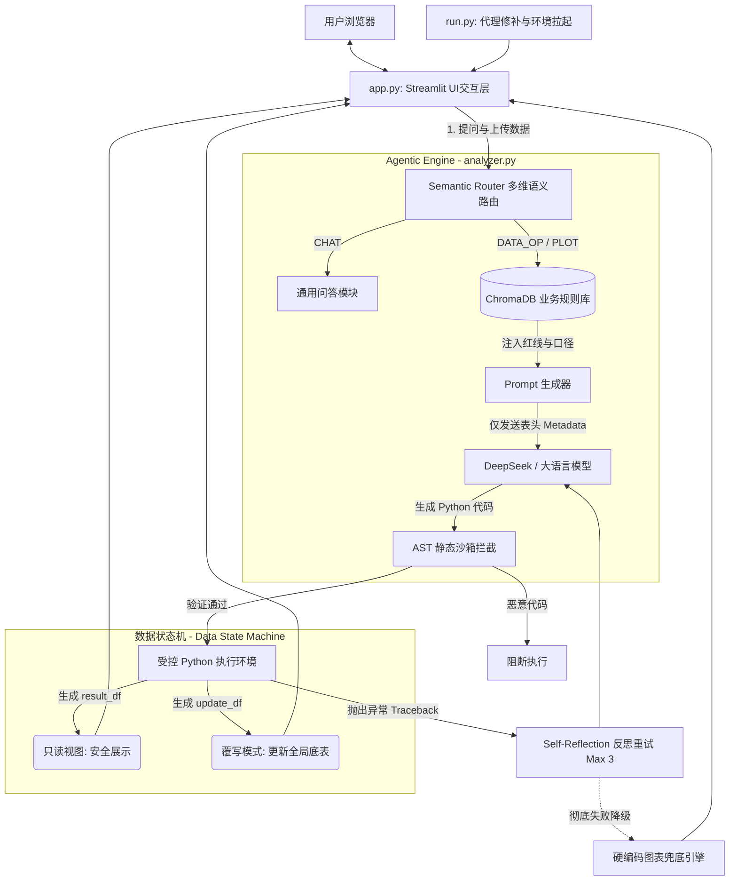

# 🏛️ AI Form Analyzer - 系统架构文档 (Architecture)

本文档旨在详细阐述 AI 智能表单分析系统的整体架构设计、核心模块交互逻辑以及关键的工程化权衡（Trade-offs），为二次开发与系统维护提供全局视野。

## 1. 系统架构图

系统采用经典的分层架构设计，并引入了 Agent 模式的核心要素（感知、路由、思考、执行、反思）。


## 2. 核心系统模块解析

### 2.1 UI与接入层 (Presentation & Entry)
* **`run.py` (环境引导程序)**: 作为系统的最底层入口，主要负责解决复杂的底层环境异常（如 macOS 下 `httpx` 读取系统代理引发的死锁问题），确保网络请求层的高度稳定。
* **`app.py` (Streamlit 前端)**: 维护用户的 Session State（包含对话上下文 `chat_history`、数据底表句柄和 `analyzer` 实例）。集成 `helpers.py` 提供的防腐器，防止大屏渲染崩溃。

### 2.2 核心 Agent 引擎 (`analyzer.py`)
系统的心脏，定义了 `AIDrivenFormAnalyzer` 类，实现了大模型与本地化执行的闭环控制：
* **`semantic_router(query)`**: 基于小样本提示（Few-shot prompting）的轻量级意图分类器，将用户输入强制归类为 `PLOT`（绘图）、`DATA_OP`（数据操作）或 `CHAT`（常规闲聊），并提取是否需要 RAG（`need_rag`）和清洗模式。
* **业务知识挂载 (ChromaDB)**: 在类初始化时构建本地 ChromaDB 客户端，存储如“TEGDP 计算公式”等企业级业务黑话，动态召回并作为提示词前缀注入。
* **`execute_agentic_code()`**: 核心执行中枢。通过捕获 `Exception` 和 `traceback.format_exc()`，实现了代码如果报错，带着报错信息回去问大模型的“反思重试（Self-Reflection）”能力。
* **`generate_chart()`**: 灾备降级策略，当 LLM 连续三次生成的代码均引发崩溃时，接管控制权，使用原生 `matplotlib` 基于现存数据绘制基础图表，保证前端可用性。

### 2.3 工具与防腐层 (`helpers.py`)
* **`extract_json_from_response(str)`**: 抵抗 LLM 输出格式幻觉的终极防线。采用“直接解析 -> 正则定位 Markdown 块 -> 正则搜索对象/数组 -> 标点符号暴力替换容错”的多级降级解析策略。
* **`make_dataframe_safe_for_ui(df)`**: UI 防腐函数。针对 PyArrow 在渲染 Pandas 混合类型 (`object`) 时极易崩溃的底层 Bug，执行精准的类型转换，同时保留数值类型的纯洁性以支持前端排序。
* **`set_chinese_font()`**: 跨平台的中文字体探测与全局注册，并修复图表负号展示异常。

## 3. 关键架构设计亮点 (Trade-offs & Innovations)

### 🌟 亮点 1：读写分离状态机 (Read-Write Segregation)
打破了传统 Code-Interpreter 直接 `eval` 用户指令的危险模式。在 `execute_agentic_code` 中严格约束大模型对数据的操作边界：
* **只读分析 (`result_df`)**：如果 LLM 的目的是查询或计算（如“筛选出前 5 名”），强制约定将结果赋值给 `result_df`。系统仅向前端抛出此视图，**全局底表零污染**。
* **底层覆写 (`update_df`)**：只有当 LLM 明确意图是清洗或新增维度（如“删除空值并保存”），才允许其将结果输出到 `update_df`，此时系统才会安全地替换内存中的全局底表 `self.processed_data`。

### 🌟 亮点 2：数据隐私适配层 (Metadata Extraction)
**解决企业痛点：数据不出域**。
每次与 LLM 通信，系统**绝对不会**将包含敏感业务数据的数据框本体发送给 API。系统通过采样等方式仅提取 Column Names（列名）和 Dtypes（数据类型），拼接成微型 JSON Schema 提供给 LLM 编写代码。真正的计算均发生在本机的沙箱环境中。

### 🌟 亮点 3：AST 静态代码沙箱 (Safe Sandbox)
通过覆盖 Python 内置的 `ast` (Abstract Syntax Tree) 模块，实现无需 Docker 级隔离的轻量级应用内安全保障：
* 在执行大模型生成的动态代码前，解析其抽象语法树。
* 遍历阻断任何涉及 `os`, `sys`, `subprocess` 的 `Import` 节点，以及诸如 `os.system`, `eval` 的 `Call` 节点，防止“Prompt 注入”导致的主机入侵。

## 4. 目录树结构

依据您的项目实际文件划分与模块解耦逻辑，推荐的标准化工程目录结构如下（请结合本地实际调整）：

```text
📦 AI-Form-Analyzer
 ┣ 📂 src                    # 核心源码目录
 ┃ ┣ 📂 core                 # 核心业务逻辑
 ┃ ┃ ┗ 📜 analyzer.py        # Agent 控制引擎与沙箱
 ┃ ┗ 📂 utils                # 基础建设与工具
 ┃ ┃ ┗ 📜 helpers.py         # JSON容错、UI防腐、字体处理
 ┃ ┗ 📂 frontend             # 前端交互
 ┃ ┃ ┗ 📜 app.py             # Streamlit 交互展现层 (UI)
 ┣ 📂 tests                  # Pytest 单元测试集
 ┃ ┣ 📜 test_helpers.py      # 测试 JSON 提取器与 UI 净化
 ┃ ┣ 📜 test_router.py       # 测试多维路由分发逻辑
 ┃ ┗ 📜 test_sandbox.py      # 测试 AST 拦截与状态机
 ┣ 📜 run.py                 # 底层系统网络与环境修补启动器
 ┣ 📜 requirements.txt       # Python 依赖清单
 ┣ 📜 README.md              # 项目功能说明
 ┣ 📜 ARCHITECTURE.md        # 架构说明文档
 ┣ 📜 .gitignore             
 ┗ 📜 LICENSE                
```
